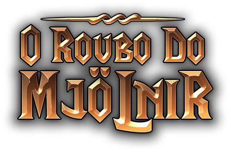

  
  Dress Up, desenvolvido na Unity.

## 📑 Indíce

- [📜 Sobre](#-sobre)
- [💻 Tecnologias](#-tecnologias)
- [⚠️ Instalação](#%EF%B8%8F-instalação)
- [📦 Builds](#-builds)

## 📜 Sobre

Jogo desenvolvido em conjunto com o Ilustrador [Yarick Ivens](https://www.behance.net/yarickivens).

Thor teve seu poderoso martelo roubado pelo gigante de gelo Thryn, e para recuperá-lo terá que enfrentar seu maior desafio!

## 💻 Tecnologias

- C#
- Unity (version: [2019.3.13f1](https://unity3d.com/pt/get-unity/download/archive?_ga=2.118344778.2126703189.1592841786-2050972297.1592582956))

## ⚠️ Instalação

Ao abrir o projeto na Unity, certifique-se de instalar os requerimentos do plugin TextMesh Pro:

    Window -> TextMeshPro -> Import TMP Essential Resources

Este plugin foi utilizado para os componentes de texto.

Para mais informações sobre o plugin acesse: https://docs.unity3d.com/Packages/com.unity.textmeshpro@2.0/manual/index.html

## 📦 Builds

Em breve!

---

  
Desenvolvido por 🤘 Diego Moreira 🎨 Yarick Ivens

   
  
  
  
  

